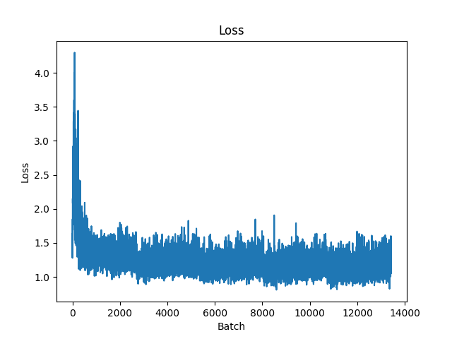

# Grill

Grill is an image-to-ingredients machine learning model to help you find your next meal.
It is based off of a fine-tuned version of the EfficientNet V2 model.

The [Recipe1M+](http://pic2recipe.csail.mit.edu/) dataset was used to train the model.

## Training

To train the model, run the following command:

```bash
python grill/train.py --epochs 10 --batch-size 64
```

## Inference

To run inference on an image, run the following command:

```bash
python grill/infer.py path/to/image.jpg
```

### Examples

```bash
> python grill/infer.py data/chili.jpg
can pinto beans (0.95), canned tomatoes (0.91), chopped thyme (0.95), chorizo sausage (0.98), clams (0.95), coconut flakes (0.91), creme fraiche (0.94), elbow macaroni (0.95), grated nutmeg (0.93), hamburger (0.97), long-grain rice (0.95), okra (0.93), pizza sauce (0.92), pound boneless (0.95), saffron thread (0.93), saffron threads (1.00), sliced onion (0.96), stick celery (0.98), tabasco (0.90), tamarind paste (0.91), thyme leaves (0.99), tomato puree (0.91), tortilla chips (0.98), turkey (0.91), whole bay leaf (0.94), whole onions (0.93), whole scallions (0.94), whole tomatoes (0.96), yellow onion (0.92)
```


